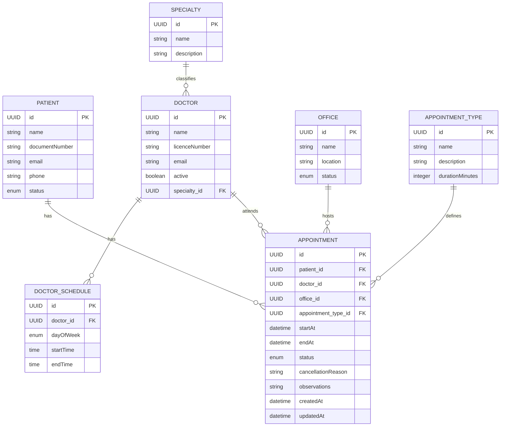

# Plataforma de Reservas de Consultorios Médicos Universitarios

API REST para la gestión de citas médicas universitarias, desarrollada con Java 21, Spring Boot, PostgreSQL y pruebas automatizadas con JUnit 5, Mockito y Testcontainers.

---

## Stack tecnológico

| Tecnología | Versión |
|---|---|
| Java | 21 |
| Spring Boot | 4 |
| PostgreSQL | 16 |
| JUnit 5 | 5.x |
| Mockito | 5.x |
| Testcontainers | 1.x |
| Lombok | 1.18.x |

---

## Estructura del proyecto

```
src/
├── main/
│   └── java/unimag/plataformamedicos/
│       ├── api/
│       │   ├── controllers/          # Controladores REST
│       │   ├── dtos/                 # DTOs agrupados por entidad
│       │   │   ├── query/            # Records internos para queries JPQL
│       │   │   ├── AppointmentDtos.java
│       │   │   ├── DoctorDtos.java
│       │   │   ├── PatientDtos.java
│       │   │   ├── OfficeDtos.java
│       │   │   ├── SpecialtyDtos.java
│       │   │   ├── AppointmentTypeDtos.java
│       │   │   ├── DoctorScheduleDtos.java
│       │   │   └── ReportDtos.java
│       │   └── mappers/              # Mappers estáticos entidad <-> DTO
│       ├── domine/
│       │   ├── entities/             # Entidades JPA
│       │   └── repositories/         # Repositorios Spring Data JPA
│       ├── enums/                    # Enums de dominio
│       ├── exception/                # Excepciones personalizadas
│       └── service/
│           ├── interfaces/           # Interfaces de service
│           └── impl/                 # Implementaciones de service
└── test/
    └── java/unimag/plataformamedicos/
        ├── domine/repositories/      # Tests de integración con Testcontainers
        └── service/                  # Tests unitarios con Mockito
```

---

## Modelo de datos

### Diagrama Entidad-Relación



### Enums

| Enum | Valores |
|---|---|
| `AppointmentStatus` | `SCHEDULED`, `CONFIRMED`, `COMPLETED`, `CANCELLED`, `NO_SHOW` |
| `PatientStatus` | `ACTIVE`, `INACTIVE` |
| `OfficeStatus` | `AVAILABLE`, `INACTIVE` |

### Relaciones

- `Specialty` 1 → * `Doctor`
- `Doctor` 1 → * `DoctorSchedule`
- `Doctor` 1 → * `Appointment`
- `Patient` 1 → * `Appointment`
- `Office` 1 → * `Appointment`
- `AppointmentType` 1 → * `Appointment`

---

## Reglas de negocio

### Creación de citas

- No se puede crear una cita en una fecha y hora pasada.
- El paciente debe existir y estar en estado `ACTIVE`.
- El doctor debe existir y estar activo (`active = true`).
- El consultorio debe existir y estar en estado `AVAILABLE`.
- La cita debe quedar dentro del horario laboral configurado para el doctor en ese día de la semana.
- El campo `endAt` **no lo manda el cliente** — lo calcula el service usando `startAt + durationMinutes` del tipo de cita.
- No puede existir traslape de horario para el doctor en el mismo rango temporal.
- No puede existir traslape de horario para el consultorio en el mismo rango temporal.
- Un paciente no puede tener dos citas activas que se crucen en el tiempo.
- Toda cita nueva se crea con estado inicial `SCHEDULED`.

### Transiciones de estado

```
SCHEDULED ──► CONFIRMED ──► COMPLETED
    │               │
    └───────────────┴──► CANCELLED
                    │
                    └──► NO_SHOW
```

| Transición | Regla |
|---|---|
| `SCHEDULED → CONFIRMED` | Solo desde `SCHEDULED`. No se puede confirmar una cita cancelada, completada o marcada como `NO_SHOW`. |
| `SCHEDULED/CONFIRMED → CANCELLED` | Solo desde `SCHEDULED` o `CONFIRMED`. Requiere motivo de cancelación obligatorio. |
| `CONFIRMED → COMPLETED` | Solo desde `CONFIRMED`. La hora actual debe ser posterior al inicio programado. Permite registrar observaciones. |
| `CONFIRMED → NO_SHOW` | Solo desde `CONFIRMED`. No se puede marcar antes de la hora de inicio. |

### Disponibilidad y reportes

- La disponibilidad depende del horario laboral del doctor, de las citas existentes (`SCHEDULED` o `CONFIRMED`) y de la duración del tipo de cita.
- Los slots devueltos son únicamente bloques completos y libres — nunca aproximados.
- La ocupación de consultorios se calcula sumando los `durationMinutes` del tipo de cita de cada cita, no contando citas. Así una cita de 50 minutos pesa más que una de 20.
- La productividad de doctores se basa en el número de citas `COMPLETED`.
- Las inasistencias identifican pacientes con mayor cantidad de `NO_SHOW` en un período.

---

## Decisiones de diseño

### DTOs agrupados por clase contenedora

En vez de tener un archivo por cada DTO, los agrupamos en una clase por entidad usando records estáticos anidados:

```java
public class PatientDtos {
    public record CreatePatientRequest(...) {}
    public record UpdatePatientRequest(...) {}
    public record PatientResponse(...) {}
    public record PatientSummaryResponse(...) {}
}
```

Esto reduce el número de archivos y deja clara la relación entre los DTOs de una misma entidad.

### Summaries en AppointmentResponse

`AppointmentResponse` no anida los objetos completos de `Patient`, `Doctor` etc., sino summaries con solo los campos necesarios para mostrar una cita. Si el cliente necesita el detalle completo de un doctor hace `GET /api/doctors/{id}`.

### Mappers estáticos

Los mappers usan métodos estáticos en vez de inyección de dependencias. El método `patch()` aplica actualizaciones parciales — solo modifica los campos que llegan no nulos en el request.

### Sin update en Appointment

Decidimos no implementar un endpoint de update para `Appointment`. Si una cita necesita modificarse, se cancela con motivo y se crea una nueva. Esto garantiza trazabilidad completa del historial de citas.

### Sin update en AppointmentType

`AppointmentType` no tiene update para proteger la consistencia de los cálculos de `endAt`. Si se necesita una duración diferente se crea un nuevo tipo. Esto evita que citas ya agendadas queden con un `endAt` inconsistente.

### Separación de updates sensibles

Operaciones sobre campos únicos o sensibles tienen su propio DTO y endpoint:
- `UpdateDoctorLicenceRequest` → `PATCH /api/doctors/{id}/licence`
- `UpdatePatientDocumentRequest` → `PATCH /api/patients/{id}/document`

Así el service puede aplicar validaciones adicionales (verificar unicidad del nuevo valor) sin contaminar el update general.

### Cálculo de ocupación por minutos

El reporte de ocupación suma los `durationMinutes` del tipo de cita en vez de contar citas. El porcentaje se calcula en el service dividiendo los minutos ocupados entre los minutos totales del rango de fechas.

### Records internos para queries JPQL

Las queries de agregación devuelven records tipados en vez de `Object[]` para evitar casteos manuales propensos a errores:

```java
public record OfficeOccupancy(Office office, Long sumOccupiedMinutes) {}
public record DoctorAppointment(Doctor doctor, Long countCompletedAppointment) {}
public record PatientCountStatus(Patient patient, Long countNoShow) {}
public record SpecialtyStats(Specialty specialty, Long cancelled, Long noShow) {}
```

## Ejecución

### Requisitos

- Java 21
- Docker (para Testcontainers y PostgreSQL)
- Maven 3.9+

### Configuración
```yaml
# application.yml
spring:
  datasource:
    url: jdbc:postgresql://localhost:5432/plataformamedicos
    username: postgres
    password: postgres
  jpa:
    hibernate:
      ddl-auto: update
    show-sql: true
```

### Levantar la base de datos con Docker Compose

El proyecto incluye un `docker-compose.yml` para levantar PostgreSQL sin instalación local:

```yaml
# docker-compose.yml
services:
  postgres:
    image: postgres:16
    container_name: plataformamedicos-db
    environment:
      POSTGRES_DB: plataformamedicos
      POSTGRES_USER: postgres
      POSTGRES_PASSWORD: postgres
    ports:
      - "5432:5432"
```

```bash
# Levantar la base de datos
docker compose up -d

# Detenerla
docker compose down
```

### Levantar el proyecto

```bash
# Clonar el repositorio
git clone <https://github.com/Joose2008/unimagdalena.plataformamedicos>
cd plataformamedicos

# Compilar (saltando tests para no requerir Docker en CI)
mvn clean install -DskipTests

# Ejecutar (requiere la base de datos levantada)
mvn spring-boot:run
```

### Ejecutar pruebas

```bash
# Todas las pruebas
mvn test

# Solo pruebas de integración (requiere Docker)
mvn test -Dtest="*IntegrationTest"

# Solo pruebas unitarias
mvn test -Dtest="*ServiceImplTest"
```

---

## Pruebas

### Tests de integración (Repository)

Usan Testcontainers para levantar una instancia real de PostgreSQL en Docker:

| Test | Qué cubre |
|---|---|
| `AppointmentRepositoryIntegrationTest` | Traslapes, ocupación, ranking de doctores, ranking de inasistencias, cancelados por especialidad |
| `PatientRepositoryIntegrationTest` | Búsqueda por estado |
| `DoctorRepositoryIntegrationTest` | Búsqueda por especialidad y estado activo |
| `DoctorScheduleRepositoryIntegrationTest` | Búsqueda por doctor y día de la semana |
| `OfficeRepositoryIntegrationTest` | Búsqueda por estado |

### Tests unitarios (Service)

Usan Mockito para aislar la lógica de negocio del repositorio:

| Test | Qué cubre |
|---|---|
| `AppointmentServiceImplTest` | Todas las reglas de creación, validaciones de estado, transiciones |
| `AvailabilityServiceImplTest` | Generación de slots, exclusión de ocupados, slots completos únicamente |
| `DoctorScheduleServiceImplTest` | Creación y consulta de horarios |
| `ReportServiceImplTest` | Cálculo de ocupación con porcentaje, productividad, ranking de inasistencias |